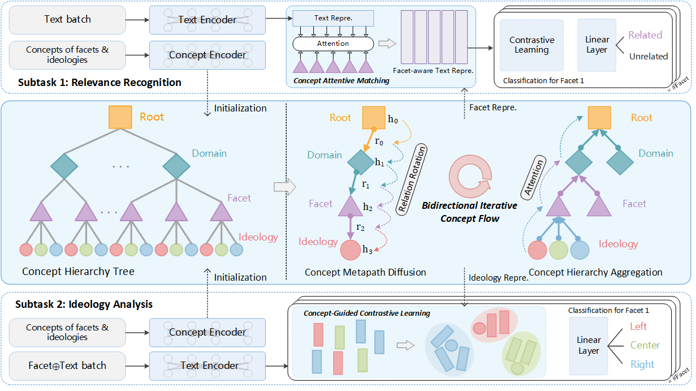

# BICo for Multifaceted Ideology Detection

Source code for the paper: Encoding Hierarchical Schema via Concept Flow for Multifaceted Ideology Detection (Findings of ACL 2024)

## Overview

Overview of our **concept-enhanced** multifaceted ideology detection framework. The blue box in the middle shows the proposed **bidirectional iterative concept flow (BICo)**, which includes root-to-leaf *concept metapath diffusion* and leaf-to-root *concept hierarchy aggregation*. The concept representations are enriched gradually by bidirectional iteration, and are then used to enhance the two subtasks of MID through *concept attentive matching* and *concept-guided contrastive learning*.

## Dataset

The experiments are based on public dataset [MITweet](https://github.com/LST1836/MITweet), we follow the same training/validation/test split and evaluation metrics.

## Usage

Run `train_relevance.py` to train the Relevance Recognition model. (Required parameters: `train_data_path`, `val_data_path`, `test_data_path`, `plm_path`)

Run `train_ideology.py` to train the Ideology Analysis model. (Required parameters: `train_data_path`, `val_data_path`, `test_data_path`, `plm_path`)

## Citation

